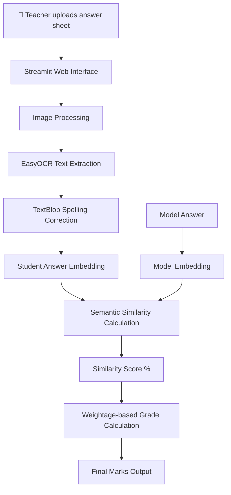

<div align="center">

# 📝 AutoGradeAI

### Intelligent Automated Grading using OCR and Semantic Similarity

**A smart AI-powered grading system that evaluates handwritten student answers by combining OCR, NLP, and semantic similarity.**
*Upload an answer sheet, compare it with the model answer, and automatically compute a fair grade.*

<br>

[](https://www.python.org/)
[](https://streamlit.io/)
[](https://github.com/JaidedAI/EasyOCR)
[](https://www.sbert.net/)
[](https://textblob.readthedocs.io/)
[]()

</div>

---

# 📖 What is AutoGradeAI?

AutoGradeAI is an **AI-powered automated grading system** designed to streamline the evaluation of handwritten student answers.

Traditional grading requires teachers to manually read and score each answer. This project eliminates that burden by combining **OCR (Optical Character Recognition)** and **semantic similarity models** to evaluate answers intelligently.

When an answer sheet is uploaded:

1. **EasyOCR extracts text** from the scanned handwritten answer.
2. **TextBlob corrects spelling errors** introduced during OCR extraction.
3. **SentenceTransformers generates embeddings** for both student and model answers.
4. The system computes a **semantic similarity score** between them.
5. The similarity score is converted into a **final grade based on configurable weightage**.

The result is a system that **evaluates answers based on meaning rather than exact wording**, making grading more fair and efficient.

---

# ✨ Features

| Feature                               | Description                                                 |
| ------------------------------------- | ----------------------------------------------------------- |
| 🧠 **AI-Powered Grading**             | Uses semantic similarity instead of simple keyword matching |
| 📝 **Handwritten Text Extraction**    | EasyOCR extracts text directly from scanned answer sheets   |
| ✍️ **Spelling Correction**            | TextBlob automatically corrects OCR mistakes                |
| 🎯 **Semantic Similarity Evaluation** | SentenceTransformers compares meaning between answers       |
| ⚖️ **Custom Weightage System**        | Teachers can define marks per question                      |
| 📊 **Similarity-Based Grading**       | Marks are calculated from similarity score percentages      |
| 🌐 **Interactive Web App**            | Built with Streamlit for easy use                           |

---

# 🏗️ System Architecture

### Grading Pipeline



---

### Processing Workflow

The grading process consists of four main stages:

1️⃣ **OCR Extraction**

* EasyOCR scans the uploaded answer sheet
* Extracts the handwritten content into machine-readable text

2️⃣ **Text Cleaning**

* TextBlob performs spelling correction
* Ensures OCR errors do not affect evaluation

3️⃣ **Semantic Comparison**

* SentenceTransformers generates embeddings
* Cosine similarity measures how closely answers match

4️⃣ **Grade Computation**

* Similarity score converted into marks
* Adjusted based on **teacher-defined weightage**

---

# 🛠️ Technology Stack

### Core System

| Component            | Technology             |
| -------------------- | ---------------------- |
| Programming Language | `Python`               |
| Web Interface        | `Streamlit`            |
| OCR Engine           | `EasyOCR`              |
| Semantic Similarity  | `SentenceTransformers` |
| Spelling Correction  | `TextBlob`             |
| Image Processing     | `PIL`                  |
| Numerical Processing | `NumPy`                |

---

# 📂 Project Structure

```text
automated-grading-system/
│
├── app.py                 # Streamlit application
├── grading_engine.py      # Core grading logic
├── ocr_processor.py       # EasyOCR extraction
├── similarity_model.py    # SentenceTransformer embedding + similarity
├── utils/
│   ├── spell_correct.py   # TextBlob spelling correction
│   └── image_utils.py     # Image preprocessing utilities
│
├── requirements.txt       # Python dependencies
└── README.md
```

---

# 🚀 Installation & Setup

### Prerequisites

* Python 3.9+
* pip
* GPU optional (for faster OCR processing)

---

## 1️⃣ Clone the Repository

```bash
git clone https://github.com/your-username/automated-grading-system.git
cd automated-grading-system
```

---

## 2️⃣ Install Dependencies

```bash
pip install -r requirements.txt
```

This installs:

* Streamlit
* EasyOCR
* SentenceTransformers
* TextBlob
* NumPy
* Pillow

---

# 🏃 Running the Application

Launch the Streamlit app:

```bash
streamlit run app.py
```

The application will start locally:

```
http://localhost:8501
```

---

# 🌐 Application Workflow

### Step 1 — Upload Answer Sheet

Upload a scanned image of the student answer sheet.

Supported formats:

* PNG
* JPG
* JPEG

---

### Step 2 — Enter Model Answer

Provide the **correct reference answer** that will be used for evaluation.

---

### Step 3 — Assign Weightage

Define the **maximum marks** for the question.

Example:

```
Total marks: 10
```

---

### Step 4 — Evaluate

Click **Evaluate**, and the system will:

* Extract text using OCR
* Correct spelling
* Compute semantic similarity
* Calculate final marks

---

# 📊 Example Output

| Metric                   | Result          |
| ------------------------ | --------------- |
| Corrected Student Answer | Displayed in UI |
| Similarity Score         | 87%             |
| Total Marks              | 10              |
| Marks Awarded            | 8.7             |

---

# ⚙️ Configuration

| Setting          | File                  | Description               |
| ---------------- | --------------------- | ------------------------- |
| OCR Model        | `ocr_processor.py`    | EasyOCR language settings |
| Similarity Model | `similarity_model.py` | SentenceTransformer model |
| Grading Logic    | `grading_engine.py`   | Score calculation formula |
| UI Interface     | `app.py`              | Streamlit UI              |

---

# 🐛 Known Issues & Troubleshooting

### OCR accuracy issues

Improve results by:

* Using **high-resolution images**
* Avoiding skewed answer sheets
* Ensuring **clear handwriting**

---

### Slow processing

OCR and embeddings can be slow on CPU.

Solutions:

* Enable GPU for EasyOCR
* Use lighter SentenceTransformer models

---

# 🔮 Future Improvements

* 🌍 **Multi-language grading**
* ✍️ **Improved handwriting recognition**
* 🧠 **Context-aware answer evaluation**
* 🗂️ **Student result database**
* 📊 **Analytics dashboard for teachers**
* 📑 **Bulk grading support**

---

# 📑 License

This project is licensed under the **MIT License**.

---

# 🙏 Acknowledgements

This project was built using several powerful open-source technologies:

* **EasyOCR** — text extraction from images
* **TextBlob** — spelling correction and NLP utilities
* **SentenceTransformers** — semantic similarity modeling
* **Streamlit** — rapid web app development for AI projects

---

<div align="center">

<br>

<i>Transforming traditional grading into intelligent AI evaluation.</i>

<br><br>

<b>AutoGradeAI</b> — because grading should measure understanding, not just keywords.

</div>
